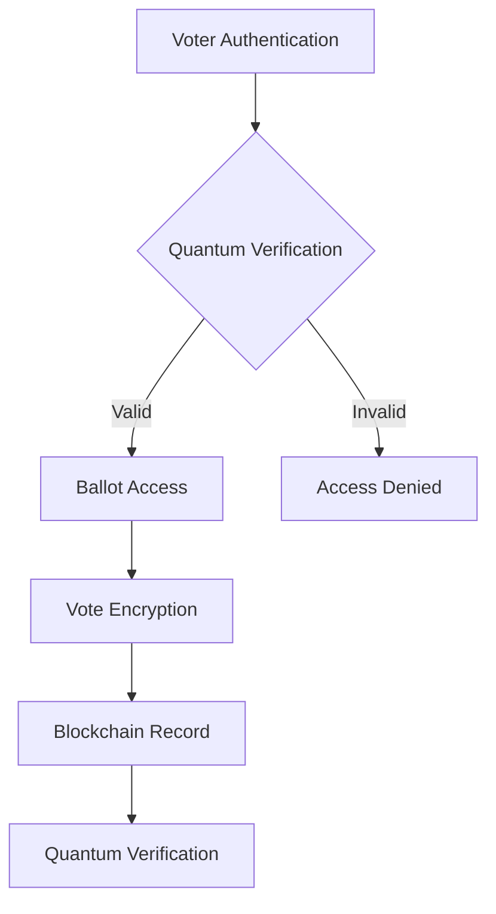

# Quantum-Secured Voting Network (QSVN)

## System Architecture Overview

A decentralized voting platform utilizing quantum entanglement and blockchain technology to ensure maximum security and verifiability of electoral processes.

### Core Components

#### 1. Quantum Security Layer
```
├── Entanglement Distribution
│   ├── Quantum Key Generation
│   │   ├── Bell Pair Creation
│   │   └── State Distribution
│   └── Key Management
└── Measurement Systems
    ├── State Verification
    └── Tampering Detection
```

#### 2. Voting Infrastructure
```solidity
contract SecureVoting {
    struct Voter {
        bytes32 voterId;
        bytes32 quantumToken;
        bool isRegistered;
        bool hasVoted;
        uint256 electionId;
    }
    
    struct Ballot {
        uint256 electionId;
        bytes32 ballotHash;
        uint32 options;
        bool isActive;
        uint256 startTime;
        uint256 endTime;
    }
    
    mapping(bytes32 => Voter) public voters;
    mapping(uint256 => Ballot) public ballots;
}
```

### Security Architecture

#### 1. Quantum Key Distribution
- Continuous-variable QKD
- Device-independent protocols
- Real-time key rotation
- Multi-node distribution network

#### 2. Vote Encryption
```
Vote Security = Quantum Key * (Blockchain Hash + Entanglement State)
Verification Score = ∑(Key Integrity * Vote Signature) / Time Factor
```

### Technical Implementation

#### Quantum Systems
1. Entanglement Generation
    - High-fidelity pair creation
    - State preservation
    - Distribution network

2. Measurement Protocol
    - Bell state analysis
    - Error correction
    - Decoherence compensation

#### Blockchain Integration
```
├── Smart Contracts
│   ├── VoterRegistry.sol
│   ├── BallotManagement.sol
│   ├── ResultCalculation.sol
│   └── AuditSystem.sol
├── Security Layer
│   ├── QuantumOracle.sol
│   └── StateVerification.sol
└── Management
    ├── ElectionConfig
    └── SecurityLogs
```

### Voting Process

#### 1. Registration Phase
- Identity verification
- Quantum token generation
- Voter credential issuance

#### 2. Voting Phase


### Security Measures

#### 1. Anti-Tampering
- Quantum state monitoring
- Continuous entanglement verification
- Immediate breach detection

#### 2. Vote Protection
- Multiple encryption layers
- Zero-knowledge proofs
- Time-locked records

### Governance Framework

#### Protocol Management
1. Security Updates
    - Quantum protocol revisions
    - Encryption enhancements
    - System upgrades

2. Voting Rules
    - Eligibility criteria
    - Authentication requirements
    - Process modifications

### Audit Systems

#### 1. Real-time Monitoring
- Vote integrity verification
- System state analysis
- Security breach detection

#### 2. Post-Election Validation
```
Audit Trail:
- Quantum state logs
- Blockchain records
- Security events
- System metrics
```

### Performance Requirements

#### 1. System Metrics
- Sub-second vote recording
- 100% vote integrity
- Zero-knowledge verification
- Real-time auditing

#### 2. Scaling Capabilities
- Million-voter capacity
- Global distribution
- Redundant systems
- Load balancing

### Emergency Protocols

#### 1. System Recovery
- State preservation
- Vote protection
- Service continuity

#### 2. Security Incidents
- Immediate containment
- Evidence preservation
- System restoration

### Future Development

#### Phase 1: Foundation
- Core quantum infrastructure
- Basic voting mechanisms
- Security protocols

#### Phase 2: Enhancement
- Advanced quantum features
- Improved scalability
- Enhanced verification

#### Phase 3: Optimization
- Maximum security
- Global deployment
- Complete automation

## Technical Guidelines

### Implementation Standards
1. Quantum Security
    - Entanglement quality
    - Key distribution
    - State verification

2. Vote Processing
    - Ballot encryption
    - Vote recording
    - Result calculation

### Operational Requirements

#### 1. System Integrity
- Continuous monitoring
- Automatic validation
- Error detection

#### 2. Data Protection
- Quantum encryption
- Blockchain immutability
- Access control

## Conclusion

The Quantum-Secured Voting Network provides an unprecedented level of security and verifiability for electoral processes through the combination of quantum entanglement and blockchain technology.
